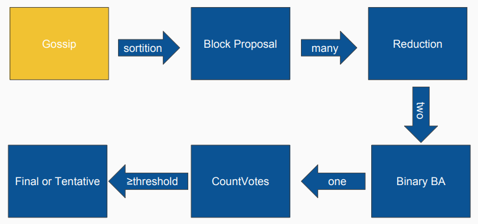
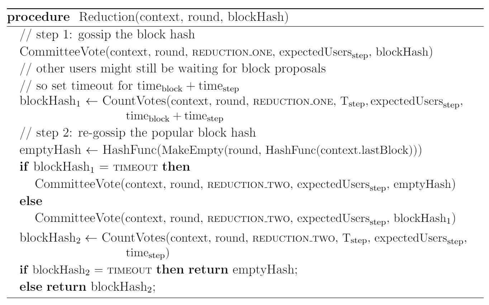
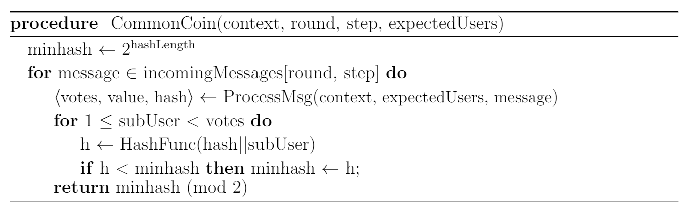

# A Guide To The Algorand Consensus Protocol
#### Authored by [onplanetnowhere](https://github.com/onplanetnowhere)

#### Index
1. [**What is Algorand?**](#what-is-algorand testing UET)
1. [**Algorand's Consensus Protocol**](#algorand's-consensus-protocol)
1. [**Cryptographic Sortition**](#cryptographic-sortition)
1. [**Block Proposal**](#block-proposal)
1. [**BA\***](#ba)
1. [**Conclusion**](#conclusion)
1. [**Glossary**](#glossary)
1. [**Further Reading**](#further-reading)

## What is Algorand?
*Algorand* is digital currency and transaction platform which implements a new consensus algorithm that aims to solve blockchain's scalability issues by *eliminating mining*, and aims for strong decentralization through *avoiding subjective influences* by relying on calculations to make all decisions. Algorand confirms transactions with latencies of *approximately a minute* even while scaling to many users, and ensures nearly instant recovery from any potential network partitions, thus there is *negligible possibility of forking* even in asynchronous environments. Algorand implements a new protocol termed [**BA\***](#ba), which is a Byzantine Agreement protocol built on [**cryptographic sortition**](#cryptographic-sortition) which uses Verifiable Random Functions (`VRFs`) that together ensure high user security. The concept of Algorand was initially constructed by *Silvio Micali*, an MIT computer scientist who has previously earned the Turing Award and Godel Prize. The development of Algorand's consensus protocol implements a multitude of novel concepts backed by rigorous proofs that have been adapted from the work of Micali and others. If you'd like, you can take a moment to check out [Algorand's official website](https://www.algorand.com/).

Now you must be wondering, that sounds great but how does Algorand achieve all this? Keep reading on!

## Algorand's Consensus Protocol
The Algorand consensus protocol, as with many other consensus protocols, is built on a P2P network that relies on communication through `gossiping` (AKA broadcasting) information to the entire network to ensure a shared state. The consensus protocol consists of `rounds`, with each `round` being the period in which a new block is proposed and agreed upon to append to the blockchain. The consensus protocol consists of two primary parts - firstly, selected `block proposers` propose blocks to the network, and secondly, selected `committee members` perform `BA*` consensus on the highest priority block while it is propagating through the network. After a block has been agreed upon, it becomes appended to the blockchain. Algorand uses algorithms that ensure only a very limited amount of users in the entire network become block proposers and committee members. By having a small amount of users acting for the entire network, Algorand is able to retain nearly consistent performance regardless of network scale.

#### Selection of Proposers and Committee Members
The Algorand consensus protocol ensures that in all parts of consensus, once a user has broadcasted their message to the network, they will not be required for the rest of the process, and thus attacks against them will not affect the network. This is possible because of a procedure called [**cryptographic sortition**](#cryptographic-sortition) that ensures no one knows who is a committee member or proposer until the selected users have already broadcasted their message to be checked by other users in the network, and different users are chosen every time a new proposer or verification committee is required.

#### Proposing a Block
[**Block proposal**](#block-proposal), in short, ensures that a random but very small amount of users are selected from the entire network to propose blocks, weighted by their account balance and some randomness. The output of `cryptographic sortition` is used to calculate a `priority` hash that is used to compare block proposers and select who is the final proposer, as well as a `proof` that proves that they were truly a selected block proposer for that `round`. The proposer with the highest priority becomes the block proposer for each round.

#### Agreement on a Block
The proposal process does not guarantee that every user receives the exact same highest priority block, thus to ensure safety, the next `Agreement` step is conducted after block proposals have been received. Every user performs [**BA\***](#ba) with their highest priority block. `BA*` executes in multiple `steps`, each beginning with `cryptographic sortition` to select verifiers. This sortition algorithm allows a user to determine if they are a committee member for a given `step`, and if so, broadcast their verification of the block to the network alongside their `proof` that they are a committee member. Each `step` repeats this process, and this process continues until users have received enough votes for consensus on the next block. The next block will either be a `proposed block`, or it will be an `empty block` in the case that agreement could not be reached once the round reaches a `TIMEOUT`. This ensures that the network will not hang, and a decision can always be made.

Now that we've covered the basics, we can get into the details of how each process works!

##### Algorand Consensus Protocol Diagram
Algorand's protocol procedures can be portrayed in a directed graph as follows. It may be helpful to refer back to this diagram as we go through each part of the process later on!

##### Implementation Parameters
Additionally, Algorand defines several parameter values used in their implementation as follows. These values will be referenced later on.

## Cryptographic Sortition
#### In Short
The goal of `cryptographic sortition` is to find a small group of users in the network such that they can be easily verified by any other user of their status as verifier or proposer using the `proofs` outputted by the algorithm. The algorithm ensures that only a small amount of users are selected based on the `weight` of each user that depends on their account balance, alongside a varying degree of randomness such that the output cannot be determined ahead of time by some attacker. This process is completely objective, meaning that the entire process is conducted purely through computation, thus human intentions are unable to sway the process.

Sortition ensures the security of the users selected as essentially, no one knows who is a proposer or verifier until they have already broadcasted their work to the network, and then anyone can verify that their proposer or verifier status is true as claimed. This is enabled through an algorithm called a Verifiable Random Function, or `VRF` which outputs a `proof` that anyone can verify with a user's `publicKey`. Additionally, no one knows if they themselves are a verifier or proposer until they have the `seed` necessary to determine their status.

The entire process itself executes as such: when a user runs sortition, they calculate a VRF `input` based on the `seed` stored in some specified previous block and a `role` value that changes depending on which part of the process they are on, then run a `VRF` using that input and their `privateKey` to calculate a verifiable `proof` and `hash`. Finally, they determine their selection status through a value called `subUsers`, which they calculate using their `hash` and account balance as a `weight` against the entire network's currency. When this `subUser` value is above 0, it means they have been selected to participate as a block proposer or committee verifier. Anyone can then validate a user's `VRF` outputs and determine their `subUser` count.

#### The Details - VRF and User Selection
Algorand implements cryptographic sortition through verifiable random functions, or `VRFs`. The objective of a `VRF` is to allow a user to generate their own proof and a hash to assist in determining their status, then allow any other user to verify it later.

A `VRF` produces a `proof` and `hash` using your `privateKey` and a random `input`. This `hash` appears completely random to any user who does not know their `privateKey`, and is used to determine proposer or committee verifier status. The `proof` allows any user to verify that, given the user's `publicKey`, the `hash` does indeed correspond to the `input` used to generate their proof in the current step, and thus verifies whether the user is indeed a proposer or verifier for the specified step. For more information on how exactly VRF works, [check out Sharon Goldberg's work](https://www.cs.bu.edu/~goldbe/projects/vrf)!

In the process of proposer and verifier selection, the value of `input` in each step is the combination of two values through concatenation: `seed` and `role`. The value of the random `seed` is refreshed after every seed refresh interval (`R`) ends. An interval is a predetermined amount of `rounds` (a round is each block selection period and its value is equal to the block number), and the value of the `role` is recalculated for every `step`, thus ensuring that `input` is never the same. Since this value is a major factor in determining who is selected, this implies selected users are different every time cryptographic sortition is conducted.

- **VRF Input:** <code>input := seed||role</code>
- **Hash & Proof:** <code>hash, proof := VRF(privateKey, input)</code>

Every `R` rounds, a seed refresh interval ends and a new seed is determined for the next interval. This value `R` is defined to be [*1000*](#implementation-parameters) rounds in Algorand's implementation. In each round, the `seed` is obtained from the block at the start of the current seed refresh interval. The block proposer of each round-1 calculates the <code>seedround</code> that will be used for the next round's sortition calls by taking the `VRF` of their `privateKey` and an `input` determined by the current interval's `seed` concatenated with the `round` number, then storing it in the block they propose along with the VRF proof. If the current block is an `empty block`, the next round's seed will instead be calculated by each user themselves via taking a cryptographic hash function of the `input`, then storing it in the block.

- **Block Proposer Seed Selection:** <code>seedround, proof := VRF(privateKey, seed||round)</code>
- **Empty Block Seed Selection:** <code>seedround := HashFunc(seed||round)</code>

Now that we have obtained a `hash` and `proof`, we can determine how likely someone is to be selected. During sortition, every user's `weight` is equal to their account balance. Algorand gives the term `subUser` to represent each unit of currency in the network, thus if a user has `x` units of currency, they have `x` `subUsers`. The `probability` that any `subUser` being chosen is equivalent to the count of `expectedUsers` we wish to choose for a step divided by the `totalCurrency` in the entire network. Note that user `weights` and network `totalCurrency` are obtained from the time of the first block in the current seed refresh interval. Then, on an interval from 0 (inclusive) to 1 (not inclusive), we divide it into `x+1` intervals based on binomial distribution (in a way that ensures that the resulting divisions are proportioned appropriately to select the `expectedUsers` from the network), with 0 being the largest range and each section after that decreasing in range. You can see an example of such division in the following image:

Then we calculate some value <code>c = hash/2hashLength</code>. This ensures that the value `c` falls in the range of `[0,1)` as depicted in the diagram above. We then take whatever `subUser` interval `c` falls into, and this becomes the `subUser` count for the user and can be thought about as the number of times they may participate. This count alongside a user's `hash` goes into determining their priority of selection for block proposer, and in the case of committee selection, the number of votes they may cast. Further details of this will be explained later on. This subUser count can be verified by anyone after verifying their VRF proof and running the same subUser calculations based on the user's account balance (weight).

Cryptographic sortition consists of two main procedures to create and validate proofs. Firstly, a user running [*Sortition*](#sortition-procedure) generates a `VRF` proof and then calculates a `subUser` count for themselves. Secondly, [*VerifySort*](#verifysort-procedure) can be run by any user receiving messages broadcasted from potential proposers and verifiers. This verification takes in the data received from messages with, verifies the `VRF` of the message, and uses the same calculations as used in [*Sortition*](#sortition-procedure) to output the `subUser` count associated with that message if the `VRF` verification is valid.

This process is outlined as such in the following algorithms for [*Sortition*](#sortition-procedure) and [*VerifySort*](#verifysort-procedure):

##### Sortition Procedure

##### VerifySort Procedure

## Block Proposal
#### In Short
At first, users will collect a pool of transactions they have heard from the P2P network. Then, during block proposal, every user runs [**cryptographic sortition**](#cryptographic-sortition) to determine how many `subUsers` (or attempts) they have to obtain their highest `priority`. If a user finds that they are a block proposer (meaning their subUser count is greater than 0), they will package their transactions into a `block` and broadcast it alongside their `proof` and `subUser` count. The network will then attempt to find the block with the highest priority to begin verification.

#### The Details - Proposer and Block Selection
First, at the start of each round, every user runs `cryptographic sortition` to calculate their `subUser` count. This amount indicates how many times they can run a calculation to determine their priority. When running cryptographic sortition, some value <code>expectedUsersproposer</code> greater than 1 is used. Algorand specifies that choosing <code>expectedUsersproposer=</code>[*26*](#implementation-parameters) allows for a reasonable amount of selected users ranging from at least 1 to no more than 70 with an extremely high probability of 1−10-11. The proof for these values can be found in *Appendix B.1* in the [technical report](https://people.csail.mit.edu/nickolai/papers/gilad-algorand-eprint.pdf).

`Priority` is calculated as follows: given a user's `subUser` count, for each `index` 1, 2, ... up to the `subUser` count, the user takes their VRF `hash` from sortition and concatenates it with the `index`. Then they use a hash function to hash this resulting `priority`. Thus, the more subUsers a user has, the more times they can attempt hashing and generate a higher priority. After running this process for all subUsers, the highest `priority` is chosen as their block's priority.

- **Potential Priority Calculation:** <code>priority := HashFunc(hash||index)</code>

The user then `gossips` two messages to the network, one with their `priority` and `proof`, the other with their `block` which also includes their `hash` and `proof`. The reason for this design is so that the first message is smaller (~200 bytes) and can propagate faster than the second message, thus users can determine the highest priority early and discard all other blocks they receive that are lower than it.

Users will wait a certain time interval before determining a highest priority block from messages they have received. Experimentally, Algorand estimates an approximate time of 10 seconds after the previous round has ended to ensure that most users have completed the last round and enough blocks have been gossiped. This value is determined by adding the time to gossip a sortition proof (<code>timepriority=</code>[*5 seconds*](#implementation-parameters)) with the estimated variance of BA* completion time (<code>timestepvar=</code>[*5 seconds*](#implementation-parameters)). Then, once the user determines the highest priority `block`, they move on to [**BA\***](#ba). If the user has not received any results for a certain time after this initial waiting period, they will instead proceed to [**BA\***](#ba) using an `empty block`. This time is the `TIMEOUT` for receiving a block, and is defined in Algorand's implementation to be <code>timeblock=</code>[*1 minute*](#implementation-parameters). This time is chosen such that it does not take excessively long to decide on a block and slow the network.

This block proposal protocol cannot be solely relied upon to produce a single output block, as propagation in the network may result in certain users receiving a different highest priority block. Thus, the next part of the protocol, [**BA\***](#ba), is required to achieve an agreement on a single output.

## BA*
#### In Short
`BA*` is a type of Byzantine Agreement protocol that attempts to achieve consensus on a block even if certain components are unreliable or malicious. In Algorand, `BA*` has two main phases, `Reduction` and `BinaryBA*`. In the `Reduction` phase, the consensus problem is reduced from potentially many blocks down to exactly two options - either a proposed block or an empty block. `BinaryBA` then takes these two choices and the network agrees on one or the other. After this, a final vote count is performed and if the votes are above a `threshold`, the network will produce a `Final Consensus` after confirming there are no other blocks that have also reached consensus. Otherwise, it will produce a `Tentative Consensus` in the case that BA* cannot ensure there are no other blocks to check for agreement. In a strongly synchronous network, this `Tentative Consensus` will be amended to be final once `Final Consensus` is reached on some block that comes some number of rounds after it, thus verifying all blocks before it. Otherwise, in a weakly synchronous network due to an attacker controlling the entire network, there is a possibility of forking, and the network will recover during a periodic recovery process by resolving forks through BA* consensus on the forks themselves, and one will be agreed upon once strong synchrony is restored (this process will not be detailed here). It is notable that this second scenario with forking is highly inprobable, with a chance of 10-12 or 10-18 as described in Algorand's [theoretical paper](https://arxiv.org/pdf/1607.01341.pdf).

The two phases consist of multiple `steps`, each of which will run [**cryptographic sortition**](#cryptographic-sortition) to select a new and unique verifier committee for voting. The repeated selection of different committees is to ensure chosen verifiers can perform their role without being compromised. In every step, committee members all broadcast their `vote` for some value they have received from the network, then all the votes are counted. Once a user receives over some `threshold` amount of votes for some value, they will broadcast their votes for that same value to the network in the next step if they become a committee member in that step.

Voting is performed on `values` set to the hashes of blocks rather than the blocks themselves. This ensures a faster and more efficient propagation through the network. Any user who is participating in the network can receive these vote messages and process them to determine the status of consensus. If any value being voted on achieves more `votes` than <code>threshold=T\*expectedUsers</code>, that value is returned as the value for that step. `T` is some value greater than 2/3, and `T` and <code>expectedUsers</code> are predetermined through a calculation that finds the minimal optimal committee size. If at any point, the processes runs out of time before any value receives sufficient votes, the system reaches a defined `TIMEOUT` state, and their vote for the next step will be determined accordingly based on the step they are on.

#### The Details - Voting and Consensus

##### BA* Procedure
The BA* procedure occurs as follows. First it undergoes `Reduction` to bring votes down to two possible hashes, then runs through `BinaryBA` to finalize consensus on a single block for `Tentative` or `Final Consensus`. Note that `context` refers to a snapshot of the current chain state, and is referenced to obtain certain details such as the last block, seed, user weights, and network total currency at certain points in time. The individual parts of this procedure will be discussed in detail shortly.

##### Voting
`BA*` relies heavily on voting, which occurs as follows. A user runs the [*CommitteeVote*](#committeevote-procedure) procedure to check their verifier status and broadcast their votes. For a user to determine if they are selected for a certain `step`, they simply run [*Sortition*](#sortition-procedure)  using an `expectedUsers` count for each step and a `role` value obtained through the string `'committee'`, the `round`, and the current `step`. This ensures that the `role` changes every step, thus selecting a different committee. If a user's `subUser` count is greater than 0, they broadcast their votes with their `publicKey` while using their `privateKey` to sign their `proof`, `hash`, `round`, `value`, and the `lastBlockHash` they know of in the chain.

The `expectedUsers` for the voting committee is determined for the network beforehand, alongside a percentage `T` that results in an approximated minimal optimal committee size for a given fraction of honest users `h`. The `expectedUsers` is really referring to the number of `subUsers` expected to be selected, which in turn represents a number of expected `votes`. The following two conditions must be satisfied when determining these values, as shown below using some number of `good` and `bad` committee members:

- **Condition 1:** <code>good > T*expectedUsers</code>
- **Condition 2:** <code>1/2good + bad < T*expectedUsers</code>

This is achieved by beginning with an arbitrarily high value of `expectedUsers`, and determining if there is a value <code>T>2/3</code> such that both conditions are satisfied. If so, the `expectedUsers` is decreased and the calculation repeated until just before there is no more such value `T`. This `expectedUsers` value is then used for sortition. The reason for requiring 2/3 votes is to ensure committee consensus even in the case of faulty committee members. The reasoning behind this is described by [Byzantine fault tolerance](https://medium.com/loom-network/understanding-blockchain-fundamentals-part-1-byzantine-fault-tolerance-245f46fe8419), which is the basis for BA*. Note that in the `FINAL` step of BA*, a different and larger set of `T` and `expectedUsers` is used that ensures an overwhelming safety probability even when the network is in weak synchrony, as this is the crucial final step of consensus. The final values should be set such that there is high security even if the block proposer with the lowest priority is malicious. Algorand specifies that, for a fraction `h=`[*80%*](#implementation-parameters) of honest users, a value of <code>expectedUsersstep=</code>[*2000*](#implementation-parameters) suffices for a <code>Tstep</code> of [*68.5%*](#implementation-parameters) during every step (thus `threshold=1370`), and in the final step, <code>expectedUsersfinal=</code>[*10000*](#implementation-parameters) `expectedUsers` suffices for a <code>Tfinal</code> of [*74%*](#implementation-parameters) (thus `threshold=7400`). The theoretical proofs and explanations behind these values can be found in *Appendix B.2* and *C.1* in the [technical report](https://people.csail.mit.edu/nickolai/papers/gilad-algorand-eprint.pdf).

Once votes are cast, a user receiving these vote `messages` can run [*CountVotes*](#countvotes-procedure) to validate and record each `message`. In this [*CountVotes*](#countvotes-procedure) procedure, the user will first validate a `message` through a procedure called [*ProcessMsg*](#processmsg-procedure) which achieves this by checking if the `signature` of the message data is true with the given `publicKey`, then checking if the `lastBlockHash` matches the hash of the user's own `lastBlock` to ensure that it extends the chain, and finally running [*VerifySort*](#verifysort-procedure) to obtain the number of `subUsers` corresponding with the message data, and this `subUser` count becomes the number of `votes` that are cast for the message's `blockHash`. *Note that this usage of the sub user count is slightly different than the usage for determining block proposer priority.* After obtaining the votes output from [*ProcessMsg*](#processmsg-procedure), a user will then add these votes to the total vote count for the corresponding value while also recording the total vote count for every value they find. Finally, they will select whichever value first receives more than a `threshold` amount of votes, equal to `T*expectedUsers`. This threshold ensures that if any honest user determines a value, all other honest users will also return either the same `value` or they will `TIMEOUT` after a certain specified duration for each step. This duration is different depending on the step being performed.

In every step of `BA*`, this [*CommitteeVote*](#committeevote-procedure) and [*CountVotes*](#countvotes-procedure) process is conducted by every user as described during the voting process. Of course, even though every user runs the [*CommitteeVote*](#committeevote-procedure), only those chosen will go through to broadcasting their votes.

##### CommitteeVote procedure

##### CountVotes procedure

##### ProcessMsg procedure

##### Reduction
The first phase of `BA*` is [*Reduction*](#reduction-procedure), which occurs in two `steps`. The purpose of the first step is for committee members to broadcast their votes for the highest priority block they have seen, while the purpose of the second step is to determine and broadcast the most popular block output voted for from the first step.

1. In the first step, a new [*CommitteeVote*](#committeevote-procedure) is conducted (using a step equal to some value `REDUCTION_ONE`) where each member picks a `blockHash` out of the hashes they have seen based on highest priority, and then broadcasts their `votes` (AKA `subUser` count) alongside the `blockHash` to the network, as well as providing the necessary data to prove their status. Then, all users count vote `messages` received by running the [*CountVotes*](#countvotes-procedure) procedure as described in the [**Voting**](#voting) section earlier. The `TIMEOUT` duration they will wait for vote messages (if they do not find a hash that surpasses the `threshold` of votes) is equivalent to 1 minute and 20 seconds, calculated by adding the timeout for receiving the last block with the timeout for a single BA* step. These times are set to <code>timeblock=</code>[*1 minute*](#implementation-parameters) and <code>timestep=</code>[*20 seconds*](#implementation-parameters) respectively in Algorand's implementation.

1. In the second step, a new [*CommitteeVote*](#committeevote-procedure) is conducted (using a step equal to some value `REDUCTION_TWO`) where members will determine the `blockHash` that first received enough votes from the first step to pass the `threshold`, and then `gossip` their `votes` for it to the network. Otherwise, if no hash surpasses the threshold after the `TIMEOUT` (set to <code>timestep=</code>[*20 seconds*](#implementation-parameters)), they will instead gossip their votes for an `emptyHash` which points to an `empty block` that stores only the current `round` and the `lastBlockHash`. Finally, users will listen for `messages` sent from this second step and count the votes and return to themselves the `blockHash` that first gets more `votes` than the `threshold`, otherwise return an `emptyHash` on `TIMEOUT`.

When the network is strongly synchronous and has an honest highest priority block proposer, nearly all users who run this [*Reduction*](#reduction-procedure) phase will begin with the same `blockHash` and also output that hash upon completion. However, if the network is weak given a dishonest proposer, users may begin with different hashes and could result in an `emptyHash` output.

##### Reduction procedure

##### BinaryBA* and Consensus
The second phase of `BA*` consists of performing [*BinaryBA\**](#binaryba-procedure), then counting the final resulting votes, and ends by reaching `Final` or `Tentative Consensus`. This phase runs in at least 2 steps and in the worst case, at most 11 steps with high probability. The process depends on 2 steps to finalize consensus, and 3 steps per repetition of [*BinaryBA\**](#binaryba-procedure) if necessary. Each full loop of [*BinaryBA\**](#binaryba-procedure) ensures honest users will reach consensus in the next two steps with a chance of 1/3. This results in the expected 2+3\*3=11 steps in the worst case. Despite this, Algorand defines `MAXSTEPS=`[*150*](#implementation-parameters) to ensure that a user will never have a chance of being stuck forever in the case a malicious adversary manipulates the network. If this maximum is reached, Algorand relies on its recovery protocol. The chance of consensus after 150 steps is negligible, at less than 3\*10-9, thus the reason for this value. A proof for these values can be found in *Appendix C.3* in the [technical report](https://people.csail.mit.edu/nickolai/papers/gilad-algorand-eprint.pdf).

[*BinaryBA\**](#binaryba-procedure) consists of a main 3 step loop and begins with the hash outputted from [*Reduction*](#reduction-procedure). In every `step`, users who find a value with votes that surpass the `threshold` will vote for that value in the next step given they are a chosen verifier. Users will use a value `r` to track the `blockHash` they will potentially use for final consensus. The phase begins first by setting `r` equal to the `blockHash` they received from [*Reduction*](#reduction-procedure). `TIMEOUT` for every vote count in this phase is set to <code>timestep=</code>[*20 seconds*](#implementation-parameters). Votes occur using <code>expectedUsersstep=</code>[*2000*](#implementation-parameters) excluding during the `FINAL` vote if it is run. This loop will break and the network will conduct the recovery process if there is ever the unlikely case that the `step` count exceeds `MAXSTEPS=`[*150*](#implementation-parameters).

1. In the first step, users will conduct a [*CommitteeVote*](#committeevote-procedure) and, if selected, broadcast their `votes` for their block hash `r`. Users then perform [*CountVotes*](#countvotes-procedure) on votes received and set `r` equal to the result.
    - If the result of [*CountVotes*](#countvotes-procedure) is a `TIMEOUT`, users assumes the hash agreed on remains the same as the one they received from reduction.
    - Otherwise, if the result is not a `TIMEOUT` and their current `r` is not an `emptyHash`, consensus has been reached.
        - Users will then attempt [*CommitteeVote*](#committeevote-procedure) 3 times for the next 3 steps (step+1 to step+3) all at once to ensure any of their potential votes for `r` can still be accounted for by other users if they reach those steps.
        - After this, if and only if the current step is 1, users conduct another [*CommitteeVote*](#committeevote-procedure) where, if selected, they will broadcast their `votes` for `r` as `FINAL` to the network. This vote is conducted using <code>expectedUsersfinal=</code>[*10000*](#implementation-parameters) as well as determining `role` using some value `FINAL` instead of the `step` to ensure a new committee is selected. This last [*CommitteeVote*](#committeevote-procedure) is guaranteed to occur in the case that the network has strong synchrony and an honest block proposer, meaning that [*BinaryBA\**](#binaryba-procedure) loop completes in 1 step.
        - Finally, [*BinaryBA\**](#binaryba-procedure) ends and users return `r` to themselves.
    - If nothing is returned, users move on to the next step.

1. In the second step, users conduct a [*CommitteeVote*](#committeevote-procedure) and, if selected, will again broadcast their `votes` for `r` to the network, then users run [*CountVotes*](#countvotes-procedure) and set `r` equal to the result.
    - Upon `TIMEOUT`, users will set their `r` equal to `emptyHash`.
    - Otherwise, if `r` is an `emptyHash`, consensus has been reached that the `blockHash` will not be chosen.
        - Then, users will attempt [*CommitteeVote*](#committeevote-procedure) 3 times for the next 3 steps all at once, and upon selection, will broadcast their `votes` for the `emptyHash`. This occurs upon weak network synchrony, resulting in `TIMEOUTs` during this process.
        - Finally, [*BinaryBA\**](#binaryba-procedure) ends and users return the `emptyHash` to themselves.
    - If nothing is returned, users proceed to the next step.

1. In the third and last step of a single loop of [*BinaryBA\**](#binaryba-procedure), users conduct another [*CommitteeVote*](#committeevote-procedure). Selected users will once again broadcast their `votes` for `r`. Then users run [*CountVotes*](#countvotes-procedure) and set `r` equal to the result.
    - In the case of a `TIMEOUT`, a special procedure called [*CommonCoin*](#commoncoin-procedure) is performed (described later on).
        - If the result of this procedure is 0, then the user sets `r` equal to `blockHash` as determined from [*Reduction*](#reduction-procedure).
        - Otherwise, `r` is set to `emptyHash`.
    - Nothing is returned in this step and users increment their `step` counter, go back to the start of the loop, and repeat the [*BinaryBA\**](#binaryba-procedure) process again.

After [*BinaryBA\**](#binaryba-procedure) concludes, a block hash is returned and stored as `blockHash*`. Then, [*CountVotes*](#countvotes-procedure) is performed one last time by all users. This vote count specifically counts all votes from the `FINAL` step (which occurs if anyone reached consensus on step 1 of [*BinaryBA\**](#binaryba-procedure)). Users will then set `r` equal to the block hash outcome of [*CountVotes*](#countvotes-procedure). Finally, users will compare `blockHash*` and `r`. If these values are the same, then `Final Consensus` is returned alongside the corresponding `block` to the `blockHash*`. Otherwise, if these values are not the same, a `Tentative Consensus` is returned along with the `block` corresponding to the `blockHash*`. This Tentative Consensus will be resolved in the future either when a future block reaches Final Consensus and subsequently verifies all blocks before it, or through a recovery process. Recall that Tentative Consensus is only reached if there is weak network synchrony and/or an adversary is controlling the network. You can see this final process described earlier in the [*BA\**](#ba-procedure) procedure. Once Final Consensus is determined, the `block` is appended to the chain.

The [*CommonCoin*](#commoncoin-procedure) procedure is a special procedure that acts to prevent an adversary's ability to manipulate the network by knowing how a user will vote after `TIMEOUT` occurs. In a potential attack, consensus could get stuck if honest users are split into two groups wherein group A votes for `emptyHash` while group B votes for `blockHash`, yet neither can obtain enough votes. However, the adversary could throw the vote to either group by either sending votes for `emptyHash` to group A to push that side over the `threshold`, or by not casting votes, thus resulting in `blockHash` to be chosen. Since the attacker must know how a user will vote after `TIMEOUT`, [*BinaryBA\**](#binaryba-procedure) runs a [*CommonCoin*](#commoncoin-procedure) procedure during the third loop step to make the decision after `TIMEOUT` unknown beforehand. This must output a binary bit of either 0 or 1, which determines whether to accept `blockHash` or `emptyHash`. The goal of this procedure is to provide a method such that enough users can observe the same bit output while ensuring the adversary cannot determine the value beforehand, thus it shuld run without requiring formal consensus from the entire network. In short, the procedure finds the `minhash` (or smallest hash) out of all `votes` received in the step, and uses it to determine 0 or 1.

This [*CommonCoin*](#commoncoin-procedure) procedure executes as follows. Firstly, all `messages` from verifiers are recorded during the third loop step and processed through [*ProcessMsg*](#processmsg-procedure) to verify and extract the sortition `hash` and `votes`. Then, for each `message`, given the its `vote` count, for each `index` 1, 2, ... up to the `vote` count, the user will concatenate the `hash` with the `index`, then use a hash function to output a hash `h`. Essentially, this will run as many times as there are `votes` in all the `messages`, then the smallest `h` hash will be chosen as the `minhash`. Finally, the user calculates a binary value `minhash mod 2` to obtain either 0 or 1, which becomes the output of [*CommonCoin*](#commoncoin-procedure).

##### BinaryBA* procedure

##### CommonCoin procedure

## Conclusion
As a short summary, I'll go over the entire thing once more in brief. So consensus relies heavily on a concept called [**Cryptographic Sortition**](#cryptographic-sortition) to hide user identities until they have already broadcasted their completely verifiable work. At the start of each round, a block is chosen during [**Block Proposal**](#block-proposal) by using sortition's output to calculate the proposer with the highest priority to be the official block proposer. Then, the hash of this block is passed to [**BA\***](#ba) in which several committee votes are run, again using sortition. Users vote on hashes as they receive other votes and hashes while they propagate around the network, and by this process the network can together whittle down the results to consensus on a proposed block or an empty block, then finally down to consensus on a single final hash, all the while working to keep any adversary's malicious tactics at bay. The block corresponding to that hash is then appended onto the chain! An additional property of Algorand's consensus protocol is that users do not need to be in perfect time sync and can still perform in an asynchronous environment, instead they simply need to have the same 'rate' of time such that all steps and processes perform in the designated time frame.

Phew! That's it for now, I won't go on any longer. I'm glad to see you stayed around till the end! I hope this provides a deeper understanding of the exact processes Algorand uses to perform its instant consensus protocol. It's quite complex, and rightfully so for all that it is able to achieve to maximize several blockchain aspects such as scalability, security, and decentralization. If you want to keep delving into the specifics of Algorand and all the proofs and algorithms not described here, or find helpful summaries of all the processes, be sure to check out the [**Further Reading**](#further-reading) section. Thanks for reading, and see you around!

## Glossary
A collection of terms referenced, collected in a convenient location
- **BA\***: a type of 'Byzantine Agreement' protocol designed and used by Algorand to vote on blocks
- **block proposer**: a selected user who may propose their block to the network to potentially be verified
- **broadcast**: see 'gossip'
- **Byzantine Agreement**: a protocol that attempts to achieve consensus on a single outcome even if certain components are unreliable or malicious
- **committee**: the group of users who act as verifiers for a block as it propagates through the network
- **committee member**: an individual user in a 'committee'
- **cryptographic sortition**: a process to verifiably select a small amount of users from a large set (using a 'VRF') weighted based on account balance and some randomness
- **gossip**: the term used by Algorand to describe the process of propagating messages through a network
- **priority**: a hash used to rank block proposers. The highest priority proposer's block becomes the chosen block for verification
- **proof**: a piece of data produced through VRFs that can be used to verify your selection status
- **role**: a value recalculated every step to ensure a different set of selected users for every step
- **round**: a value akin to the height of the block chain. A single round consists of one proposal and agreement procedure
- **seed**: a value used in cryptographic sortition to obtain the same selected users for any step of consensus
- **step**: each round in BA* consists of several steps, with at most 13 steps with high probability
- **subUser**: in the selection process, having more than 0 subUsers means you are selected. In proposer selection, the number of subUsers is the number of 'tries' you have to obtain your highest priority. In verifier selection, the number of subUsers is the number of votes you cast
- **verifier**: see 'committee member'
- **VRF**: a pseudo-random function that provides publicly verifiable proofs of its output's correctness

## Further Reading
- *Algorand's Website:* https://www.algorand.com/
- *Algorand: Scaling Byzantine Agreements for Cryptocurrencies:* https://dl.acm.org/citation.cfm?id=3132757
- *Algorand Theoretical Paper:* https://arxiv.org/pdf/1607.01341.pdf
- *Algorand's Instant Consensus Protocol:* https://medium.com/algorand/algorands-instant-consensus-protocol-e66ac5807e37
- *Algorand Slides:* https://web.eecs.umich.edu/~manosk/assets/slides/w18/algorand.pdf
- *Verifiable Random Functions (VRFs):* https://www.cs.bu.edu/~goldbe/projects/vrf
